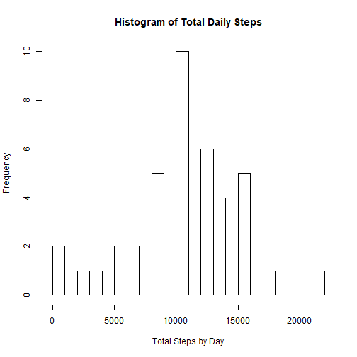
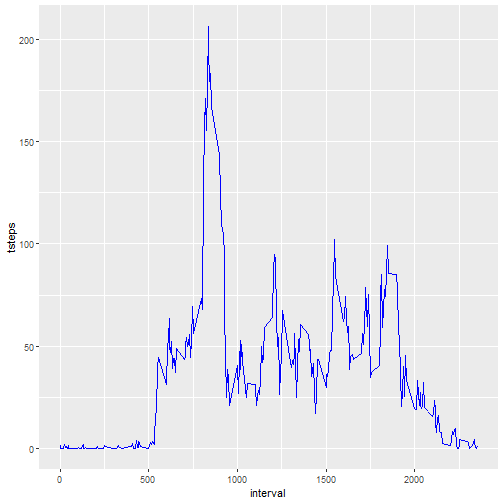
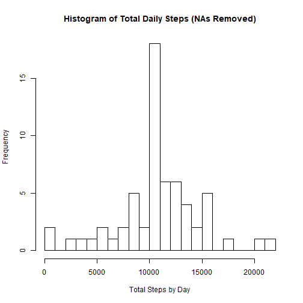
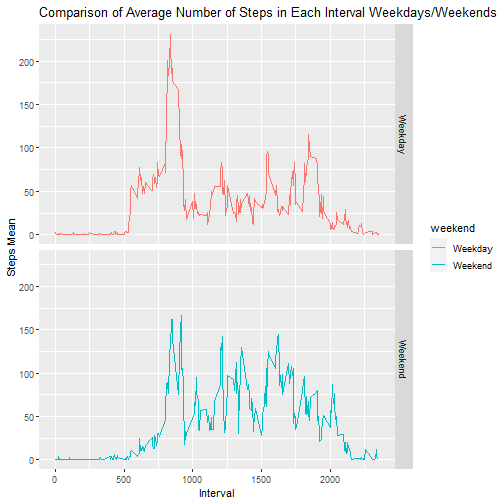

# 1. Code for reading in the dataset and/or processing the data

```r
download.file("https://d396qusza40orc.cloudfront.net/repdata%2Fdata%2Factivity.zip", destfile = "activity.zip", mode="wb")
unzip("activity.zip")
ds <- read.csv("activity.csv", header = TRUE)
head(ds)
```

```
##   steps       date interval
## 1    NA 2012-10-01        0
## 2    NA 2012-10-01        5
## 3    NA 2012-10-01       10
## 4    NA 2012-10-01       15
## 5    NA 2012-10-01       20
## 6    NA 2012-10-01       25
```
# 2. Histogram of the total number of steps taken each day

```r
    library(dplyr)
ds_d <- ds %>% 
      select(date, steps) %>%
      group_by(date) %>%
      summarize(tot_steps = sum(steps)) %>% 
      na.omit()
    hist(ds_d$tot_steps, xlab = "Total Steps by Day", main = "Histogram of Total Daily Steps", breaks = 30)
```


# 3. Mean and median number of steps taken each day

```r
mean(ds_d$tot_steps)
```

```
## [1] 10766.19
```

```r
median(ds_d$tot_steps)
```

```
## [1] 10765
```
# 4. Time series plot of the average number of steps taken

```r
library(ggplot2)
    ds_i <- ds %>%
      select(interval, steps) %>%
      na.omit() %>%
      group_by(interval) %>%
      summarize(tsteps = mean(steps))
    ggplot(ds_i, aes(x = interval, y = tsteps))+geom_line(color="blue")
```


# 5. The 5-minute interval that, on average, contains the maximum number of steps

```r
ds_i[which(ds_i$tsteps == max(ds_i$tsteps)),]
```

```
## # A tibble: 1 x 2
##   interval tsteps
##      <int>  <dbl>
## 1      835   206.
```
# 6. Code to describe and show a strategy for imputing missing data
## 6.1 Calculate and report the total number of missing values in the dataset

```r
summary(is.na(ds$steps))
```

```
##    Mode   FALSE    TRUE 
## logical   15264    2304
```
## 6.2 Strategy for filling in all of the missing values in the dataset
The average of the 5-minute interval in the whole dataset will be used to replace the NAs. A new dataset is created.

```r
 repNAs <- function(x) replace(x, is.na(x), mean(x, na.rm = TRUE))
    meanrmv <- ds %>%
      group_by(interval) %>%
      mutate(steps = repNAs(steps))
    head(meanrmv)
```

```
## # A tibble: 6 x 3
## # Groups:   interval [6]
##    steps date       interval
##    <dbl> <fct>         <int>
## 1 1.72   2012-10-01        0
## 2 0.340  2012-10-01        5
## 3 0.132  2012-10-01       10
## 4 0.151  2012-10-01       15
## 5 0.0755 2012-10-01       20
## 6 2.09   2012-10-01       25
```
# 7. Histogram of total number of steps taken each day with the NAs replaced; mean & median of total number of steps per day

```r
ds_d2 <- meanrmv %>% 
      select(date, steps) %>%
      group_by(date) %>%
      summarize(tot_steps2 = sum(steps)) %>% 
      na.omit()
```

```
## Adding missing grouping variables: `interval`
```

```r
hist(ds_d2$tot_steps2, xlab = "Total Steps by Day", main = "Histogram of Total Daily Steps (NAs Removed)", breaks = 30)
```



```r
 dsbyday <- aggregate(meanrmv$steps, by = list(meanrmv$date), sum)
    names(dsbyday)[1]="date"
    names(dsbyday)[2]="TotalSteps"
    summary(dsbyday)
```

```
##          date      TotalSteps   
##  2012-10-01: 1   Min.   :   41  
##  2012-10-02: 1   1st Qu.: 9819  
##  2012-10-03: 1   Median :10766  
##  2012-10-04: 1   Mean   :10766  
##  2012-10-05: 1   3rd Qu.:12811  
##  2012-10-06: 1   Max.   :21194  
##  (Other)   :55
```
# 8. Panel plot comparing the average number of steps taken per 5-minute interval across weekdays and weekends

```r
 meanrmv$date <- as.Date(meanrmv$date)
    meanrmv$weekday <- weekdays(meanrmv$date)
    meanrmv$weekend <- ifelse(meanrmv$weekday == "sábado" | meanrmv$weekday == "domingo", "Weekend", "Weekday")
    meandata <- aggregate(meanrmv$steps, by=list(meanrmv$weekend, meanrmv$interval), na.omit(mean))
    names(meandata) <- c("weekend", "interval", "steps")
    ggplot(meandata, aes(x=interval, y=steps, color=weekend))+
      geom_line()+
      facet_grid(weekend ~.)+
      xlab("Interval")+
      ylab("Steps Mean")+
      ggtitle("Comparison of Average Number of Steps in Each Interval Weekdays/Weekends")
```


